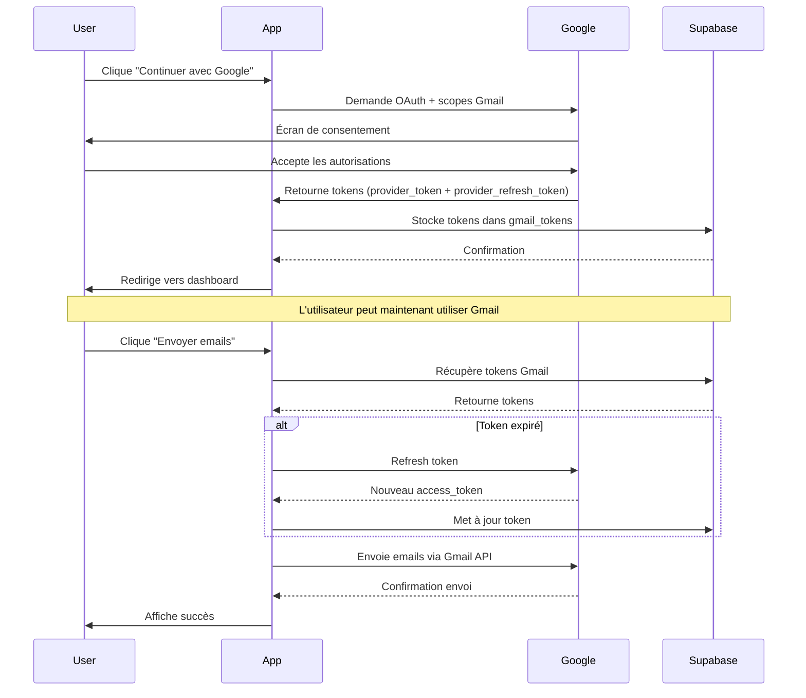

# Guide de passage en production Gmail API

## Résumé des changements

Votre application utilise maintenant un **flux d'authentification unique** :

1. **Connexion initiale** : L'utilisateur se connecte via Google OAuth avec les scopes Gmail
2. **Stockage des tokens** : Les tokens Gmail sont automatiquement stockés en base de données
3. **Utilisation transparente** : Les fonctions d'envoi d'emails utilisent les tokens stockés automatiquement
4. **Rafraîchissement automatique** : Les tokens expirés sont rafraîchis automatiquement

## État actuel (Mode Test)

Actuellement, votre application Gmail API est en **mode test** avec ces limitations :
- Seuls les emails autorisés peuvent utiliser l'application
- Nombre limité d'utilisateurs (100 maximum en mode test)
- Écran de consentement affiche "Non vérifié"

## Passage en mode Production

### Étape 1 : Préparer l'écran de consentement OAuth

1. Allez dans la [Console Google Cloud](https://console.cloud.google.com)
2. Sélectionnez votre projet
3. Accédez à **APIs & Services** > **OAuth consent screen**
4. Complétez toutes les informations requises :
   - **Application name** : Nom de votre application
   - **User support email** : Email de support
   - **Application homepage** : URL de votre application
   - **Application privacy policy** : URL de votre politique de confidentialité
   - **Application terms of service** : URL de vos conditions d'utilisation
   - **Authorized domains** : Ajoutez votre domaine (ex: `votre-domaine.com`)
   - **Developer contact information** : Vos coordonnées

### Étape 2 : Demander la vérification

1. Sur la page **OAuth consent screen**, cliquez sur **Publish app**
2. Soumettez votre application pour vérification
3. Préparez les documents suivants :
   - Vidéo de démonstration montrant l'utilisation des scopes Gmail
   - Explication de pourquoi vous avez besoin des scopes Gmail
   - Politique de confidentialité expliquant comment vous gérez les données Gmail

### Étape 3 : Scopes nécessaires

Votre application utilise ces scopes Gmail :
```
https://www.googleapis.com/auth/gmail.send
https://www.googleapis.com/auth/gmail.compose
```

**Justification à fournir à Google** :
- `gmail.send` : Permet d'envoyer des emails depuis le compte Gmail de l'utilisateur pour la prospection d'entreprises
- `gmail.compose` : Permet de créer des brouillons Gmail pour que l'utilisateur puisse les personnaliser avant envoi

### Étape 4 : Délai de vérification

- **Délai habituel** : 4 à 6 semaines
- **Possibilité de refus** : Google peut demander des modifications
- **Conseils** :
  - Soyez transparent sur l'utilisation des données
  - Montrez clairement comment l'utilisateur garde le contrôle
  - Expliquez les bénéfices pour l'utilisateur

## Fonctionnement après validation

Une fois votre application validée :

1. **Tous les utilisateurs peuvent se connecter** : Plus de limitation à 100 utilisateurs
2. **Pas de liste blanche** : N'importe quel email Google peut utiliser votre app
3. **Écran de consentement vérifié** : Badge "Vérifié par Google"
4. **Expérience utilisateur améliorée** : Pas d'avertissement de sécurité

## Architecture technique

### Tables Supabase

```sql
gmail_tokens
├── user_id (UUID) - Référence à auth.users
├── access_token (TEXT) - Token d'accès Gmail
├── refresh_token (TEXT) - Token de rafraîchissement
├── expires_at (TIMESTAMPTZ) - Date d'expiration
└── updated_at (TIMESTAMPTZ) - Dernière mise à jour
```

### Edge Functions

1. **store-gmail-tokens** : Stocke les tokens après l'authentification OAuth
2. **refresh-gmail-token** : Rafraîchit un token expiré
3. **send-gmail-emails** : Envoie des emails via Gmail API
4. **create-gmail-drafts** : Crée des brouillons Gmail

### Flux d'authentification



## Sécurité

- ✅ Tokens stockés de manière sécurisée dans Supabase
- ✅ RLS (Row Level Security) actif : chaque utilisateur voit uniquement ses tokens
- ✅ Tokens chiffrés en base de données
- ✅ Refresh automatique des tokens expirés
- ✅ Pas de tokens exposés côté client

## Maintenance

### Gérer les tokens révoqués

Si un utilisateur révoque l'accès Gmail :
1. Les edge functions retourneront une erreur "Gmail not connected"
2. L'utilisateur devra se reconnecter avec Google
3. Les nouveaux tokens remplaceront automatiquement les anciens

### Surveillance

Surveillez ces métriques :
- Taux d'échec des envois d'emails
- Nombre de rafraîchissements de tokens
- Erreurs "Gmail not connected"

## Support

Si vous rencontrez des problèmes :
1. Vérifiez les logs des edge functions dans Lovable Cloud
2. Consultez les [docs Gmail API](https://developers.google.com/gmail/api)
3. Vérifiez la [FAQ OAuth de Google](https://support.google.com/cloud/answer/10311615)

## Checklist avant production

- [ ] Écran de consentement OAuth complété
- [ ] Politique de confidentialité rédigée et publiée
- [ ] Conditions d'utilisation rédigées et publiées
- [ ] Vidéo de démonstration créée
- [ ] Demande de vérification soumise à Google
- [ ] Configuration des domaines autorisés
- [ ] Tests effectués avec plusieurs comptes
- [ ] Monitoring des edge functions configuré
- [ ] Plan de gestion des erreurs en place
